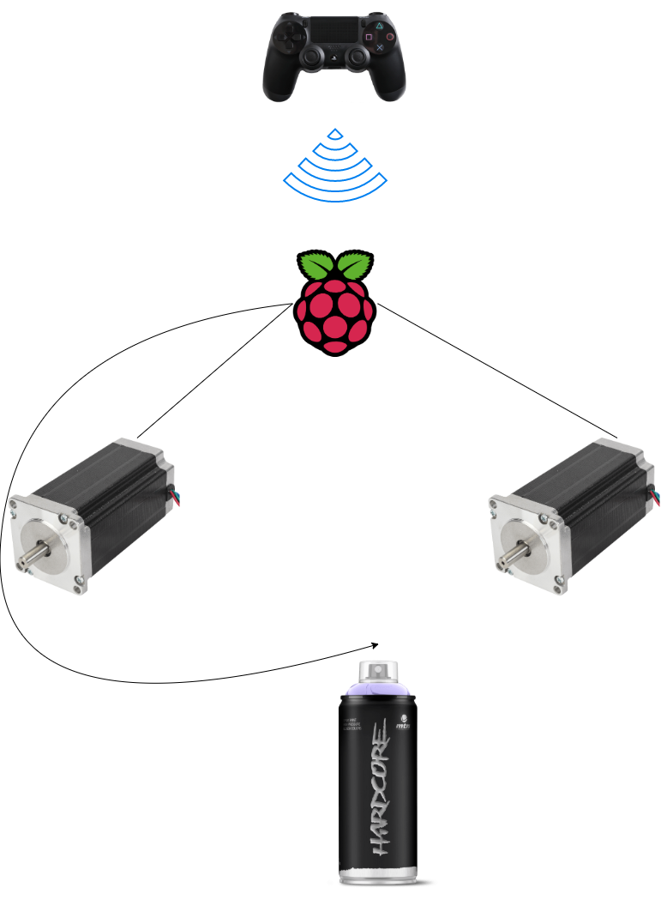

# IDEAS

## Architecture

### Control unit

- Raspberry Pi (RPi)
- Battery for steppers (min 12v)
- Battery for RPi (5v)
- Bluetooth antenna to gain signal

### Stepper (x2)

- Reel
- String where spray hangs
- Fixing mechanism (make the stepper be steady in different environments)
- Wire to connect to control unit (power +, power -, control signal, direction signal)

### Spray

- Servo (connected to control unit: power +, power -, control signal)
- 3D to attach servo to spray
- Fixing mechanism (structure to attach the strings from the spray to the steppers and legs to give distance from the wall)
